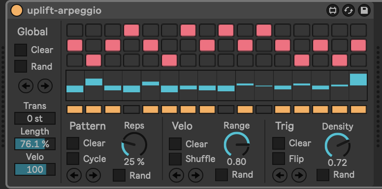
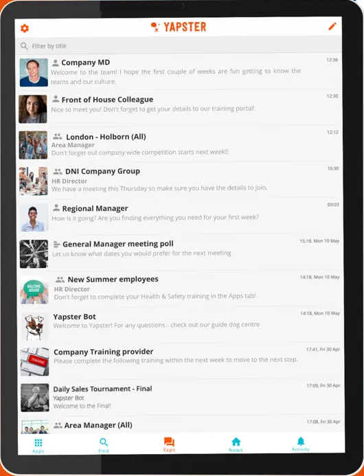

# 👋 About 

I'm a programmer, [former academic](#-research--publications) and [music producer](https://linktr.ee/danielefilaretti).

Although lately my main focus have been on <em>music/audio technology</em>, 
I also have a keen interest in <em>functional programming</em> (with hands-on experience in languages such 
as Haskell and Clojure) and extensive research experience in the field of formal methods (static analysis, abstract interpretation, proof assistants etc.)

* [🧑‍💻 stuff I'm  working on](#-stuff-im-working-on)
* [🌱 stuff I'm learning](#-stuff-im-learning)
* [🎧 past projects (audio / music technology)](#-past-projects-audio--music-technology)
* [👨‍💻 past projects (misc)](#-past-projects-misc)
* [🧪 research & publications](#-research--publications)

For more details, please see [my CV](assets/cv/Daniele%20Filaretti%20CV.pdf).

# 🧑‍💻 Stuff I'm working on

## Sweeper

<em>Co-author & Lead developer 2024-Present</em>

An audio FX plugin designed in collaboration with acclaimed 
trance producer [Steve Allen](https://www.facebook.com/steveallenofficial/). It should be the first of a series of releases.

More info soon 🔥

    

## img2ASCII

<em>Author 2025-Present</em>

As I've been [learning Rust](#-stuff-im-learning) during the last couple of months, I decided to get some practice by building this fun little project
that converts image files to ASCII art. 

One of the goals was also to familiarize with functional programming techniques in Rust 
(e.g. I didn't use any `for` loop to iterate through the image pixels, but relied on iterators facilities; also tried not to use `mut`able variables)

Check out the [README](https://github.com/dfilaretti/img2ascii_rust)!

    

# 🌱 Stuff I'm learning

## Rust

As a C++ developer with some familiarity with functional programming languages such as Haskell, Rust definitely caught my attention. 

I love Rust's memory safety (coming from C++, it's a big thing!), modern and smooth tooling experience and those language features (expression-oriented, algebraic data types, iterators, immutability by default etc.) that makes it feel a bit more like a functional language while still giving you all the power and performance of C++ (and the ability to work on audio plugins, which is pretty much exclusive domain of C++!)

To get started with the language I am...

- reading the official [Rust Book](https://doc.rust-lang.org/book/title-page.html)
- completing the [Rustlings](https://github.com/rust-lang/rustlings) exercises
- as a little, fun project, developing a small CLI app to convert images to ASCII art ([repo](https://github.com/dfilaretti/img2ascii_rust))

  

# 🎧 Past projects (audio / music technology)

## Loopcloud

<em>Developer 2020-2024</em>

Since 2020, I contributed to the development of the Loopcloud desktop app and its companion audio plugin 
(which syncs the app to the user's DAW for a more integrated experience).

I delivered several new major features (such as <em>collections</em>, MIDI support and an onboarding interactive tutorial), 
and an extensive UI rework, in addition to countless bug fixes and workflow improvements.

    

## TATAT

<em>Lead developer 2021-2022</em>

[TATAT](https://k-devices.com/products/tatat/) is a MIDI plugin designed for 3 main purposes: to 
create always-changing sequences, to quickly sketch and store music ideas, to add unexpected 
events to fixed patterns.

      

## Solid State Logic (SSL) 

<em>Developer 2016-2017</em>

I had the privilege of working at legendary SSL headquarters in Oxford. 

During my tenure there I helped develop and maintain the software powering Solid State Logic’s high-end digital consoles in both the Broadcast (System T) and Live (L200, L350 etc.) product families (C#).

 

## Uplift Arpeggio

<em>Author 2020-Present</em>

A Max4Live device I built for helping me quickly come up with lead 
patterns when writing trance. It started as a 2020 lockdown project 
but it's still receiving updates! 

  

## Free plugins bundle

<em>Author 2018</em>

A bunch of free audio plugins I wrote while learning JUCE.

 - a nice [drum synth](https://github.com/dfilaretti/WeirdDrums)
 - a simple [waveshaper](https://github.com/dfilaretti/waveshaper-demo)
 - [stereo width](https://github.com/dfilaretti/stereowidth-demo) utility 
 - a [bitcrusher][https://github.com/dfilaretti/bitcrusher-demo-2]

  

# 👨‍💻 Past projects (misc)

## Yapster

<em>Clojure Developer (full-stack) 2019 - 2020</em>

Helped developing [Yapster](https://www.yapster.info/) - a messaging app for the workplace; contributing new features across both frontend and backend as well as bug-fixes (Clojure/ClojureScript).

I <em> really </em> enjoyed learning and working with the [Clojure](https://clojure.org/) 
programming language! 

   

## K-Framework (Haskell backend)

<em>Developer 2018</em>

According to its [official docs](https://kframework.org/index.html), 

<em>"K is a rewrite-based executable semantic framework in which programming languages, 
type systems and formal analysis tools can be defined using configurations and rules"</em>

I loved using K as the foundational framework for my [research work](https://www.doc.ic.ac.uk/~maffeis/phpsemantics/) as a PhD student,  
and I was privileged, a couple of years later, to be able to contribute 
back to its community (as well as practicing some [Haskell](https://www.haskell.org/)!)

  

## Solidity to IELE compiler

<em>Developer 2018</em>

[IELE](https://runtimeverification.com/the-iele-virtual-machine) is an improvement on the [Ethereum blockchain virtual machine](https://ethereum.org/en/developers/docs/evm/).
 It was created after the [KEVM](https://github.com/runtimeverification/evm-semantics) project demonstrated that a K formal specification of EVM could automatically generate a VM comparable in performance to hand-crafted implementations.

I helped developing the Solidity to IELE compiler.

   

## DIMMAND

<em>Lead Developer 2016 - 2017</em>

Lead the development of [DIMMAND](https://www.festoon.studio/dimmand), a cross-platform 
digital solution for detecting literacy difficulties 
& strengths in children.

  

# 🧪 Research & publications

I hold a PhD in <em>Computing</em> from [Imperial College London](https://www.imperial.ac.uk/), where I worked in the field
of <em>programming language</em> theory and <em>formal methods</em>. 

My thesis was about the formalisation of the PHP programming language 
and the development of a static analysis tool derived from the formal semamtics (see below).

Here are the main research projects and publications I worked on during the years. 

## Projects

### K-PHP (Executable formal semantics of PHP)

<em>Lead Developer / PhD Student 2018</em>

[KPHP](https://github.com/dfilaretti/KPHP) is a <em>formal specification</em> of the PHP 
programming language written in the [K-Framework](https://kframework.org/index.html), 
together with a prototype bug finding tool based on the theory 
of [abstract interpretation](https://en.wikipedia.org/wiki/Abstract_interpretation) 
and derived directly from the formal semantics.

* [website](https://phpsemantics.org/)
* [repo](https://github.com/dfilaretti/KPHP)
* [paper](assets/publications/ecoop14.pdf)
* [PhD thesis](assets/publications/Filaretti-D-PhD-2016.pdf)

### JCCert / JSRef (Certified Javascript)

<em>Developer / PhD Student 2018</em>

[JSCert](https://jscert.org/) is a <em>mechanised specification</em> of JavaScript, 
written in the [Coq](https://coq.inria.fr/) proof assistant.
JSRef is a <em>reference interpreter</em> for JavaScript in OCaml, which has 
been proved correct with respect to JSCert and tested with the Test 262 test suite.

* [website](https://jscert.org/)
* [repo](https://github.com/jscert/jscert)
* [paper](assets/publications/popl14.pdf)

## Publications 

### 2019

* [IELE: A Rigorously Designed Language and Tool Ecosystem for the Blockchain](assets/publications/iele-fm-2019.pdf) with T. Kasampalis, D. Guth, B. Moore, T. Serbanuta, V. Serbanuta, G. Rosu and Ralph Johnson - International Symposium on Formal Methods 2019. 

### 2018

* [A Digital App to Aid Detection, Monitoring, and Management of Dyslexia in Young Children (DIMMAND): Protocol for a Digital Health and Education Solution](http://www.researchprotocols.org/2018/5/e135/) with MR Sood, A. Toornstra, M. Sereno, M. Boland, A. Sood - 2018 

### 2016

* [An Executable Formal Semantics of PHP with Applications to Program Analysis](assets/publications/Filaretti-D-PhD-2016.pdf). PhD Thesis, Imperial College London, 2016.

### 2014

* [An Executable Formal Semantics for PHP](assets/publications/ecoop14.pdf) - with S. Maffeis - ECOOP 2014.

* [A Trusted Mechanised JavaScript Specification](assets/publications/popl14.pdf) - with M. Bodin, A. Chargueraud, P. Gardner, S.Maffeis, D. Naudziuniene, A. Schmitt, G. Smith - POPL 2014.

### 2011

* [Building bricks with bricks, with Mathematica](assets/publications/mathematica11.pdf) - with P. Codara, O. D'Antona - Mathematica Italian User Group Meeting 2011.
